# SalesFlow

SalesFlow is a full-stack quotation, invoice, payment, and receipt management system built as a portfolio project.

The project demonstrates a real-world sales workflow commonly used in small and medium businesses.

## Tech Stack

### Backend

- Laravel 12
- Laravel Sanctum
- MySQL
- REST API
- Role-based authorization
- CSV export

### Frontend

- React
- TypeScript
- Vite
- Tailwind CSS
- Axios
- React Router

## Core Features

### Authentication and Authorization

- Login and logout with Laravel Sanctum
- Role-based UI permissions
- Backend role authorization middleware
- Demo users for Admin, Sales, Accountant, and Manager

### Customer Management

- Create, update, list, and view customers
- Auto-generate customer code
- Active and inactive customer status

### Product and Service Management

- Manage products and services
- Auto-generate product and service code
- Price and unit management

### Quotation Management

- Create quotations with multiple line items
- Auto-calculate subtotal, discount, tax, and total amount
- Quotation workflow:
  - Draft
  - Sent
  - Accepted
  - Rejected
  - Converted

### Invoice Management

- Convert accepted quotation to invoice
- Auto-generate invoice number
- Track invoice status:
  - Unpaid
  - Partially Paid
  - Paid
  - Overdue
  - Cancelled

### Payment Management

- Record partial or full payments
- Auto-update invoice paid amount
- Auto-update invoice balance due
- Auto-update invoice status after payment
- Delete payment and recalculate invoice balance

### Receipt Management

- Auto-generate receipt when payment is recorded
- Receipt list page
- Receipt detail page

### Dashboard

- Customer summary
- Product and service summary
- Quotation summary
- Invoice summary
- Revenue summary
- Outstanding balance
- Recent quotations
- Recent invoices
- Recent payments

### Reports

- Sales report
- Payment report
- Outstanding invoice report
- Date range filters
- Status and payment method filters
- CSV export

### Audit Logs

- Track important system actions:
  - Create quotation
  - Send quotation
  - Accept quotation
  - Reject quotation
  - Convert quotation to invoice
  - Record payment
  - Delete payment
  - Mark overdue invoices

- Search and filter audit logs
- View old values and new values

## Roles and Permissions

| Feature               | Admin | Sales | Accountant |   Manager |
| --------------------- | ----: | ----: | ---------: | --------: |
| Dashboard             |   Yes |   Yes |        Yes |       Yes |
| Customers             |   Yes |   Yes |         No |        No |
| Products and Services |   Yes |   Yes |         No |        No |
| Quotations            |   Yes |   Yes |  View only | View only |
| Invoices              |   Yes |    No |        Yes | View only |
| Payments              |   Yes |    No |        Yes | View only |
| Receipts              |   Yes |    No |        Yes | View only |
| Reports               |   Yes |    No |        Yes |       Yes |
| Audit Logs            |   Yes |    No |         No |       Yes |

## Demo Accounts

| Role       | Email                                                         | Password |
| ---------- | ------------------------------------------------------------- | -------- |
| Admin      | [admin@salesflow.test](mailto:admin@salesflow.test)           | password |
| Sales      | [sales@salesflow.test](mailto:sales@salesflow.test)           | password |
| Accountant | [accountant@salesflow.test](mailto:accountant@salesflow.test) | password |
| Manager    | [manager@salesflow.test](mailto:manager@salesflow.test)       | password |

## Main Workflow

```text
Customer
→ Product / Service
→ Quotation
→ Send Quotation
→ Accept Quotation
→ Convert to Invoice
→ Record Payment
→ Generate Receipt
```

## Project Structure

```text
salesflow/
├── salesflow-api/
└── salesflow-web/
```

## Backend Setup

Go to the backend project:

```bash
cd salesflow-api
```

Install dependencies:

```bash
composer install
```

Create environment file:

```bash
cp .env.example .env
```

Generate application key:

```bash
php artisan key:generate
```

Update database configuration in `.env`:

```env
DB_CONNECTION=mysql
DB_HOST=127.0.0.1
DB_PORT=3306
DB_DATABASE=salesflow
DB_USERNAME=root
DB_PASSWORD=
```

Run migrations and seeders:

```bash
php artisan migrate --seed
```

Start the backend server:

```bash
php artisan serve
```

Backend URL:

```text
http://127.0.0.1:8000
```

## Frontend Setup

Go to the frontend project:

```bash
cd salesflow-web
```

Install dependencies:

```bash
npm install
```

Create environment file:

```env
VITE_API_BASE_URL=http://127.0.0.1:8000/api
```

Start the frontend server:

```bash
npm run dev
```

Frontend URL:

```text
http://localhost:5173
```

## Useful Commands

### Backend

```bash
php artisan migrate
php artisan db:seed
php artisan invoices:mark-overdue
php artisan route:list
```

### Frontend

```bash
npm run dev
npm run build
```

## CSV Export

The system supports CSV export for:

- Sales report
- Payment report
- Outstanding invoice report

CSV files include UTF-8 BOM to support Thai text in Excel.

## Screenshots

### Login

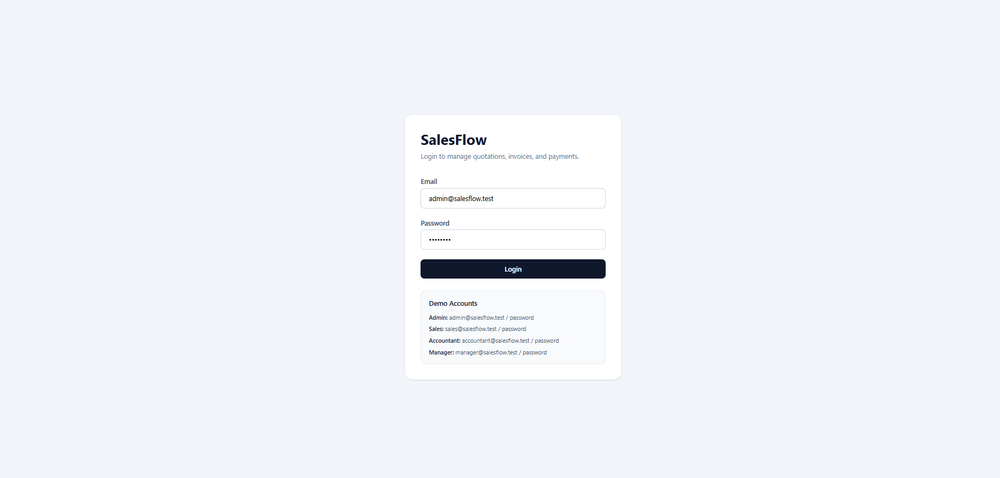

### Dashboard

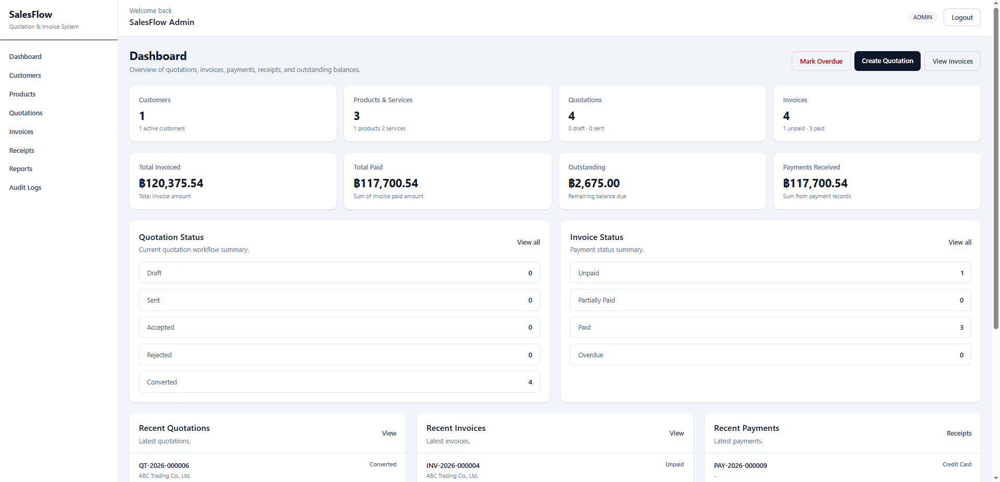

### Customers

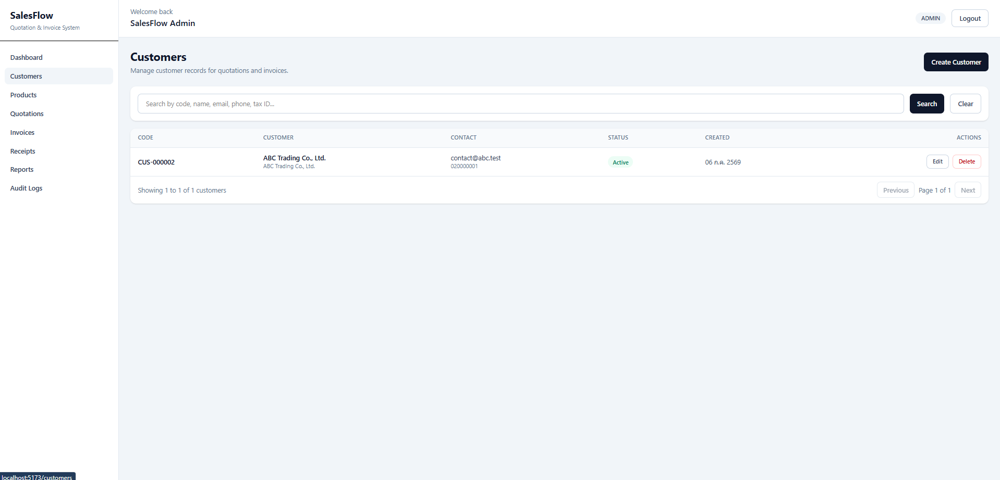

### Products and Services

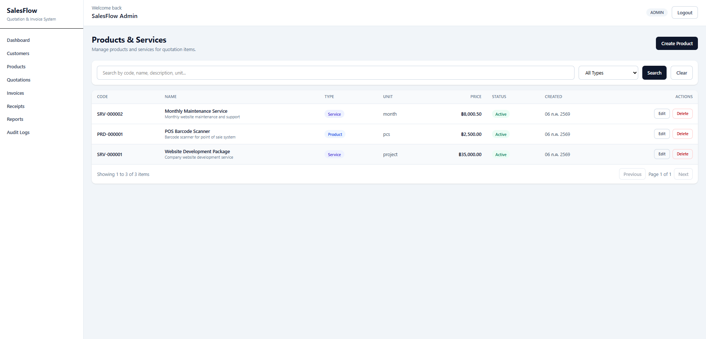

### Quotations

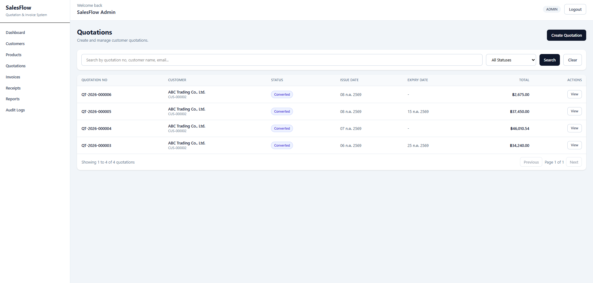

### Quotation Detail

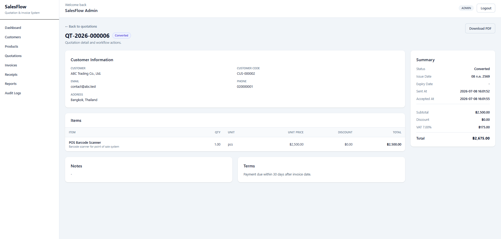

### Invoices

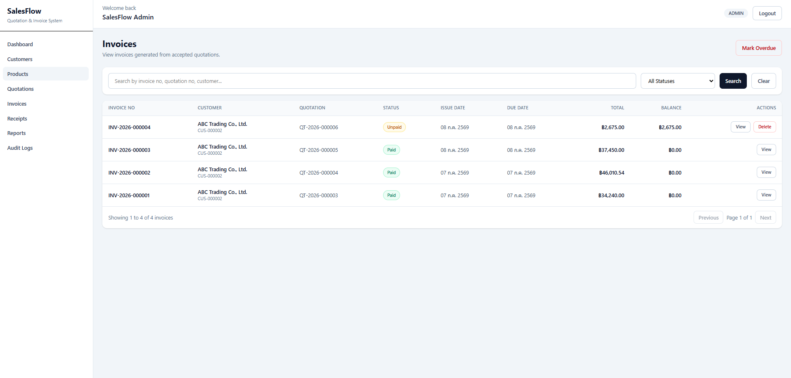

### Invoice Detail

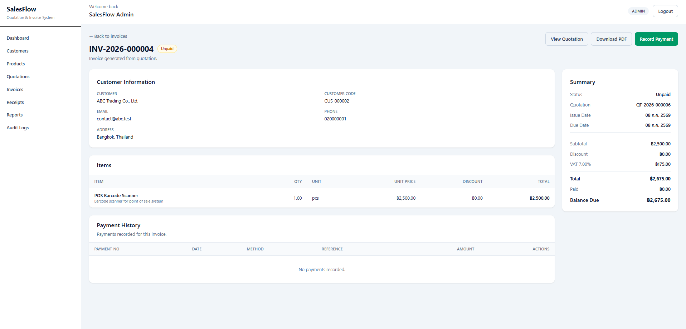

### Receipts

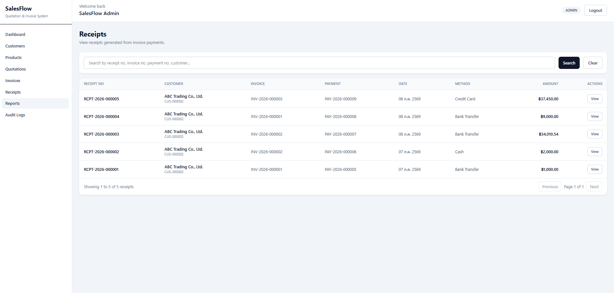

### Receipt Detail

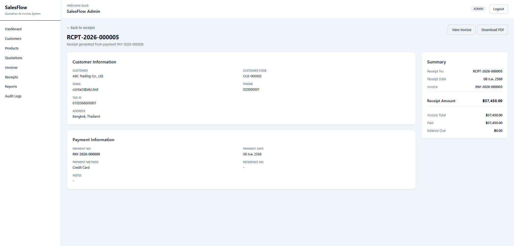

### Reports

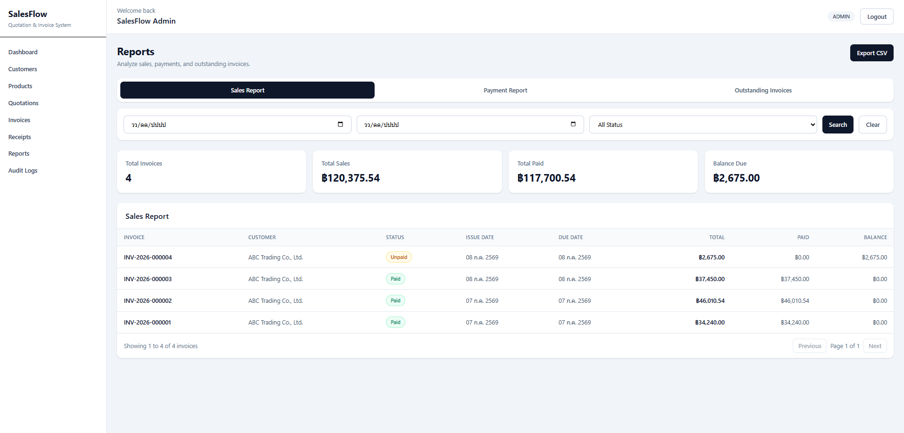

### Audit Logs

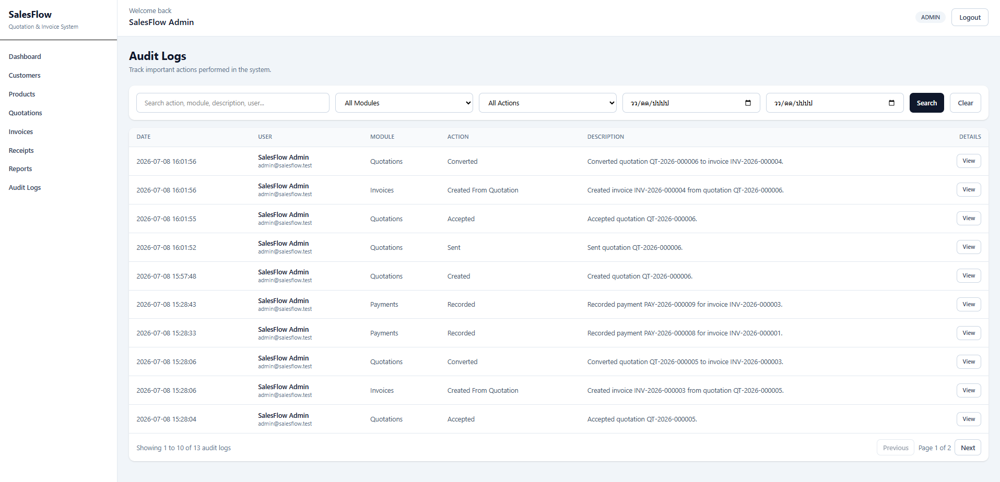

## Status

Core portfolio features are completed.

Planned improvements:

- Quotation PDF export
- Invoice PDF export
- Receipt PDF export
- Email quotation to customer
- Advanced report charts
- Deployment
