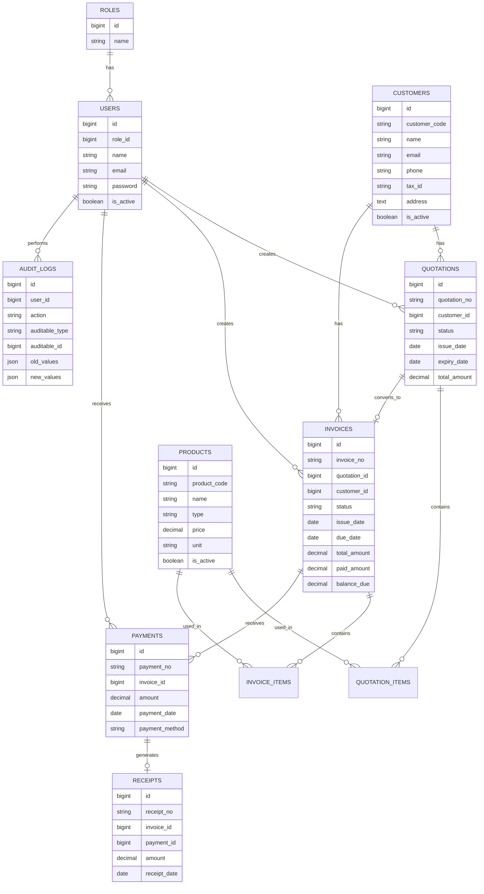

# SalesFlow - Step 0: Requirements & Architecture Plan

## Project Name

**SalesFlow - Quotation, Invoice & Payment Management System**

## Project Goal

SalesFlow is a full-stack portfolio project designed to simulate a real company workflow for managing customers, quotations, invoices, payments, receipts, reports, and audit logs.

The goal is to build a practical business system that can be showcased on GitHub, Resume, and job interviews.

---

## Tech Stack

### Backend

- Laravel 12 REST API
- MySQL
- Laravel Sanctum
- Role-based access control
- PDF export
- CSV export

### Frontend

- React
- TypeScript
- Vite
- Tailwind CSS

---

## Main Workflow

```text
Customer
→ Create Quotation
→ Quotation status = DRAFT
→ Send Quotation
→ Customer accepts
→ Convert to Invoice
→ Invoice status = UNPAID
→ Record Payment
→ Invoice status = PARTIALLY_PAID / PAID
→ Generate Receipt
```

---

## Roles

| Role | Description |
|---|---|
| ADMIN | Full system access, user management, master data, reports, audit logs |
| SALES | Manage customers and quotations |
| ACCOUNTANT | Manage invoices, payments, receipts, and reports |
| MANAGER | View dashboard, reports, and audit logs |

---

## Feature List

### Authentication

- Login
- Logout
- Authenticated user profile
- Protected API routes

### Dashboard

- Total customers
- Total quotations
- Pending quotations
- Total invoices
- Unpaid invoices
- Overdue invoices
- Total revenue
- Monthly revenue

### Customer Management

- Create customer
- View customer list
- View customer detail
- Update customer
- Soft delete customer
- Search / filter customers

### Product / Service Management

- Create product or service
- View product list
- View product detail
- Update product
- Soft delete product
- Product type: PRODUCT / SERVICE

### Quotation Management

- Create quotation draft
- Add quotation items
- Calculate subtotal, discount, tax, total
- Send quotation
- Accept quotation
- Reject quotation
- Convert quotation to invoice

### Invoice Management

- Generate invoice from quotation
- View invoice list
- View invoice detail
- Track invoice status
- Detect overdue invoices
- Generate invoice PDF

### Payment Recording

- Record payment
- Support partial payment
- Support full payment
- Auto-update invoice status
- Generate receipt after payment

### Receipt

- View receipt list
- View receipt detail
- Generate receipt PDF

### Reports

- Sales report
- Payment report
- Outstanding invoice report
- CSV export

### Role & Permission

- Restrict features by role
- Backend policy checks
- Frontend menu visibility by role

### Audit Log

- Track important user actions
- Track created, updated, deleted records
- Track workflow actions such as send, accept, convert, and payment

---

# MVP Scope

The MVP should focus on the main business workflow first.

## MVP Features

1. Login / Logout
2. Role seed: ADMIN, SALES, ACCOUNTANT, MANAGER
3. Dashboard summary
4. Customer management
5. Product / Service management
6. Quotation management
7. Quotation status workflow
8. Convert quotation to invoice
9. Invoice management
10. Payment recording
11. Auto update invoice status
12. Generate basic receipt data
13. Basic audit log

---

## Features for Later Phase

| Feature | Reason |
|---|---|
| Invoice PDF | Requires stable invoice data first |
| Receipt PDF | Should be built after payment and receipt logic |
| CSV Export | Should be built after reports |
| Advanced Reports | Requires enough business data |
| Real overdue notification | Start with overdue badge first |
| Advanced permission system | Start with simple role-based policy first |

---

# Permission Plan

| Feature | ADMIN | SALES | ACCOUNTANT | MANAGER |
|---|---:|---:|---:|---:|
| Dashboard | Yes | Yes | Yes | Yes |
| Customer | Yes | Yes | View only | View only |
| Product / Service | Yes | View only | View only | View only |
| Quotation | Yes | Yes | View only | View only |
| Convert Quotation to Invoice | Yes | Yes | Yes | View only |
| Invoice | Yes | View only | Yes | View only |
| Payment | Yes | No | Yes | View only |
| Receipt | Yes | View only | Yes | View only |
| Reports | Yes | No | Yes | Yes |
| Audit Log | Yes | No | No | Yes |
| User Management | Yes | No | No | No |

---

# ERD Draft



---

# Database Schema Plan

## roles

```text
id
name
created_at
updated_at
```

Example role names:

```text
ADMIN
SALES
ACCOUNTANT
MANAGER
```

---

## users

```text
id
role_id
name
email
password
is_active
email_verified_at
remember_token
created_at
updated_at
```

---

## customers

```text
id
customer_code
name
company_name
email
phone
tax_id
address
contact_name
contact_phone
is_active
created_by
updated_by
created_at
updated_at
deleted_at
```

Notes:

- Use soft delete.
- Customer data should not be permanently deleted because it may be linked to old quotations and invoices.

---

## products

```text
id
product_code
name
type
description
unit
price
is_active
created_by
updated_by
created_at
updated_at
deleted_at
```

Product type:

```text
PRODUCT
SERVICE
```

---

## quotations

```text
id
quotation_no
customer_id
status
issue_date
expiry_date
sub_total
discount_amount
tax_rate
tax_amount
total_amount
notes
terms
created_by
sent_at
accepted_at
converted_at
created_at
updated_at
deleted_at
```

Quotation status:

```text
DRAFT
SENT
ACCEPTED
REJECTED
EXPIRED
CONVERTED
```

---

## quotation_items

```text
id
quotation_id
product_id
item_name
description
quantity
unit
unit_price
discount_amount
tax_amount
line_total
created_at
updated_at
```

Notes:

- `product_id` should be nullable to allow manual item names.
- `item_name` should be stored even when product_id exists, because product names may change later.

---

## invoices

```text
id
invoice_no
quotation_id
customer_id
status
issue_date
due_date
sub_total
discount_amount
tax_rate
tax_amount
total_amount
paid_amount
balance_due
notes
created_by
created_at
updated_at
deleted_at
```

Invoice status:

```text
UNPAID
PARTIALLY_PAID
PAID
OVERDUE
CANCELLED
```

Notes:

- `quotation_id` should be nullable for future support of direct invoice creation.

---

## invoice_items

```text
id
invoice_id
product_id
item_name
description
quantity
unit
unit_price
discount_amount
tax_amount
line_total
created_at
updated_at
```

---

## payments

```text
id
payment_no
invoice_id
payment_date
amount
payment_method
reference_no
notes
received_by
created_at
updated_at
deleted_at
```

Payment methods:

```text
CASH
BANK_TRANSFER
CREDIT_CARD
CHEQUE
```

---

## receipts

```text
id
receipt_no
invoice_id
payment_id
receipt_date
amount
issued_by
created_at
updated_at
deleted_at
```

---

## audit_logs

```text
id
user_id
action
auditable_type
auditable_id
old_values
new_values
ip_address
user_agent
created_at
updated_at
```

Audit actions:

```text
CREATED
UPDATED
DELETED
SENT
ACCEPTED
REJECTED
CONVERTED
PAID
```

---

# Important Database Rules

## Money Columns

Use `decimal(12, 2)` for money values.

Examples:

```text
price
sub_total
discount_amount
tax_amount
total_amount
paid_amount
balance_due
amount
```

Do not use `float` for money.

---

## Soft Delete

Use soft delete for important business records:

```text
customers
products
quotations
invoices
payments
receipts
```

Do not physically delete records that may be used in reports or old documents.

---

# Status Workflow Plan

## Quotation Status Workflow

```text
DRAFT
→ SENT
→ ACCEPTED
→ CONVERTED
```

Alternative paths:

```text
SENT → REJECTED
SENT → EXPIRED
```

## Quotation Status Rules

| Action | From | To |
|---|---|---|
| Create quotation | None | DRAFT |
| Send quotation | DRAFT | SENT |
| Customer accepts | SENT | ACCEPTED |
| Convert to invoice | ACCEPTED | CONVERTED |
| Customer rejects | SENT | REJECTED |
| Mark expired | SENT | EXPIRED |

---

## Invoice Status Workflow

```text
UNPAID
→ PARTIALLY_PAID
→ PAID
```

Additional statuses:

```text
OVERDUE
CANCELLED
```

## Invoice Status Rules

| Condition | Invoice Status |
|---|---|
| paid_amount = 0 | UNPAID |
| paid_amount > 0 and paid_amount < total_amount | PARTIALLY_PAID |
| paid_amount >= total_amount | PAID |
| due_date < today and invoice is not paid | OVERDUE |

---

# API Route Plan

API prefix:

```text
/api
```

---

## Auth Routes

```text
POST   /api/auth/login
POST   /api/auth/logout
GET    /api/auth/me
```

---

## Dashboard Routes

```text
GET    /api/dashboard/summary
```

---

## Customer Routes

```text
GET    /api/customers
POST   /api/customers
GET    /api/customers/{customer}
PUT    /api/customers/{customer}
DELETE /api/customers/{customer}
```

---

## Product Routes

```text
GET    /api/products
POST   /api/products
GET    /api/products/{product}
PUT    /api/products/{product}
DELETE /api/products/{product}
```

---

## Quotation Routes

```text
GET    /api/quotations
POST   /api/quotations
GET    /api/quotations/{quotation}
PUT    /api/quotations/{quotation}
DELETE /api/quotations/{quotation}

POST   /api/quotations/{quotation}/send
POST   /api/quotations/{quotation}/accept
POST   /api/quotations/{quotation}/reject
POST   /api/quotations/{quotation}/convert-to-invoice
```

---

## Invoice Routes

```text
GET    /api/invoices
POST   /api/invoices
GET    /api/invoices/{invoice}
PUT    /api/invoices/{invoice}
DELETE /api/invoices/{invoice}

GET    /api/invoices/overdue
GET    /api/invoices/{invoice}/pdf
```

Notes:

- `POST /api/invoices` can be kept for future direct invoice creation.
- MVP should focus on converting quotation to invoice first.

---

## Payment Routes

```text
GET    /api/payments
POST   /api/payments
GET    /api/payments/{payment}
DELETE /api/payments/{payment}
```

Notes:

- Recording payment should update invoice status automatically.
- Recording payment should generate receipt automatically.

---

## Receipt Routes

```text
GET    /api/receipts
GET    /api/receipts/{receipt}
GET    /api/receipts/{receipt}/pdf
```

---

## Report Routes

```text
GET    /api/reports/sales
GET    /api/reports/payments
GET    /api/reports/outstanding-invoices

GET    /api/reports/sales/export-csv
GET    /api/reports/payments/export-csv
```

---

## Admin Routes

```text
GET    /api/users
POST   /api/users
GET    /api/users/{user}
PUT    /api/users/{user}
DELETE /api/users/{user}

GET    /api/roles
```

---

## Audit Log Routes

```text
GET    /api/audit-logs
GET    /api/audit-logs/{auditLog}
```

---

# Laravel Folder Structure Plan

Backend project name:

```text
salesflow-api
```

Recommended structure:

```text
app/
├── Actions/
│   ├── Quotations/
│   │   ├── SendQuotationAction.php
│   │   ├── AcceptQuotationAction.php
│   │   └── ConvertQuotationToInvoiceAction.php
│   ├── Invoices/
│   │   └── UpdateInvoicePaymentStatusAction.php
│   └── Payments/
│       └── RecordPaymentAction.php
│
├── Enums/
│   ├── QuotationStatus.php
│   ├── InvoiceStatus.php
│   ├── PaymentMethod.php
│   └── ProductType.php
│
├── Http/
│   ├── Controllers/
│   │   └── Api/
│   │       ├── AuthController.php
│   │       ├── DashboardController.php
│   │       ├── CustomerController.php
│   │       ├── ProductController.php
│   │       ├── QuotationController.php
│   │       ├── InvoiceController.php
│   │       ├── PaymentController.php
│   │       ├── ReceiptController.php
│   │       ├── ReportController.php
│   │       ├── UserController.php
│   │       └── AuditLogController.php
│   │
│   ├── Requests/
│   │   ├── Auth/
│   │   │   └── LoginRequest.php
│   │   ├── Customers/
│   │   │   ├── StoreCustomerRequest.php
│   │   │   └── UpdateCustomerRequest.php
│   │   ├── Products/
│   │   │   ├── StoreProductRequest.php
│   │   │   └── UpdateProductRequest.php
│   │   ├── Quotations/
│   │   │   ├── StoreQuotationRequest.php
│   │   │   └── UpdateQuotationRequest.php
│   │   └── Payments/
│   │       └── StorePaymentRequest.php
│   │
│   └── Resources/
│       ├── UserResource.php
│       ├── CustomerResource.php
│       ├── ProductResource.php
│       ├── QuotationResource.php
│       ├── InvoiceResource.php
│       ├── PaymentResource.php
│       ├── ReceiptResource.php
│       └── AuditLogResource.php
│
├── Models/
│   ├── Role.php
│   ├── User.php
│   ├── Customer.php
│   ├── Product.php
│   ├── Quotation.php
│   ├── QuotationItem.php
│   ├── Invoice.php
│   ├── InvoiceItem.php
│   ├── Payment.php
│   ├── Receipt.php
│   └── AuditLog.php
│
├── Policies/
│   ├── CustomerPolicy.php
│   ├── ProductPolicy.php
│   ├── QuotationPolicy.php
│   ├── InvoicePolicy.php
│   ├── PaymentPolicy.php
│   └── AuditLogPolicy.php
│
└── Services/
    ├── DocumentNumberService.php
    ├── AuditLogService.php
    ├── QuotationCalculatorService.php
    ├── InvoiceCalculatorService.php
    └── ReportService.php
```

---

# React Folder Structure Plan

Frontend project name:

```text
salesflow-web
```

Recommended structure:

```text
src/
├── app/
│   ├── App.tsx
│   ├── router.tsx
│   └── providers.tsx
│
├── assets/
│
├── components/
│   ├── common/
│   │   ├── Button.tsx
│   │   ├── Input.tsx
│   │   ├── Select.tsx
│   │   ├── Modal.tsx
│   │   ├── Table.tsx
│   │   ├── Badge.tsx
│   │   └── Pagination.tsx
│   └── layout/
│       ├── AppLayout.tsx
│       ├── Sidebar.tsx
│       ├── Topbar.tsx
│       └── ProtectedRoute.tsx
│
├── features/
│   ├── auth/
│   │   ├── LoginPage.tsx
│   │   ├── authApi.ts
│   │   ├── authTypes.ts
│   │   └── useAuth.ts
│   │
│   ├── dashboard/
│   │   ├── DashboardPage.tsx
│   │   ├── dashboardApi.ts
│   │   └── dashboardTypes.ts
│   │
│   ├── customers/
│   │   ├── CustomerListPage.tsx
│   │   ├── CustomerCreatePage.tsx
│   │   ├── CustomerEditPage.tsx
│   │   ├── customerApi.ts
│   │   └── customerTypes.ts
│   │
│   ├── products/
│   ├── quotations/
│   ├── invoices/
│   ├── payments/
│   ├── receipts/
│   ├── reports/
│   ├── users/
│   └── auditLogs/
│
├── lib/
│   ├── api.ts
│   ├── authStorage.ts
│   ├── formatCurrency.ts
│   ├── formatDate.ts
│   └── permissions.ts
│
├── types/
│   ├── api.ts
│   ├── pagination.ts
│   └── role.ts
│
├── main.tsx
└── index.css
```

---

# Development Roadmap

## Step 0 - Planning

- Requirements
- MVP Scope
- ERD
- Database schema plan
- API route plan
- Laravel folder structure
- React folder structure
- Development roadmap
- Best practices

## Step 1 - Project Setup

- Create Laravel project
- Create React TypeScript Vite project
- Install Tailwind CSS
- Configure MySQL
- Initialize Git
- Create basic README

## Step 2 - Backend Foundation

- Install API support
- Configure Sanctum
- Create roles and users migrations
- Create role seeder
- Create admin user seeder
- Create login/logout/me API
- Test with Postman

## Step 3 - Frontend Foundation

- Setup routing
- Setup API client
- Create login page
- Store auth token
- Create protected route
- Create app layout
- Create sidebar by role

## Step 4 - Customer Management

- Customer migration
- Customer model
- Customer controller
- Customer requests
- Customer resource
- Customer API routes
- Customer pages
- Search and pagination

## Step 5 - Product / Service Management

- Product migration
- Product model
- Product controller
- Product requests
- Product resource
- Product pages

## Step 6 - Quotation Management

- Quotation migration
- Quotation item migration
- Quotation model
- Quotation item model
- Create quotation draft
- Add quotation items
- Calculate total
- Quotation list and detail pages

## Step 7 - Quotation Workflow

- Send quotation
- Accept quotation
- Reject quotation
- Status validation
- Audit log

## Step 8 - Convert Quotation to Invoice

- Convert accepted quotation to invoice
- Copy quotation items to invoice items
- Generate invoice number
- Set invoice status to UNPAID
- Use database transaction

## Step 9 - Invoice and Payment

- Invoice list
- Invoice detail
- Record payment
- Partial payment
- Full payment
- Update invoice status automatically
- Generate receipt

## Step 10 - Dashboard and Overdue Alert

- Dashboard cards
- Monthly revenue
- Unpaid invoices
- Overdue invoices
- Overdue badge

## Step 11 - Role and Permission

- Laravel policies
- Role checks
- Frontend permission guard
- Hide or show menu by role

## Step 12 - Reports and CSV

- Sales report
- Payment report
- Outstanding invoice report
- CSV export

## Step 13 - PDF

- Invoice PDF
- Receipt PDF
- Optional quotation PDF

## Step 14 - Portfolio Polish

- README
- Screenshots
- Demo accounts
- API documentation
- GitHub cleanup
- Resume bullet points

---

# Best Practices

## Laravel API

1. Keep controllers thin.
2. Move business logic to Actions or Services.
3. Use Form Request classes for validation.
4. Use API Resources for JSON responses.
5. Use Enums or constants for statuses.
6. Use database transactions for important workflows.
7. Use policies for role-based permission.
8. Use decimal columns for money.
9. Use soft delete for business records.
10. Add audit logs for important actions.

## Validation Style

Use string pipe format for simple validation rules.

Example:

```php
'name' => 'required|string|max:255',
'email' => 'nullable|email|max:255',
```

Use array format only when object rules are needed.

Example:

```php
'email' => [
    'required',
    'email',
    Rule::unique('users')->ignore($user->id),
],
```

---

## React + TypeScript

1. Organize files by feature.
2. Keep API calls in separate files.
3. Define TypeScript types for API data.
4. Use protected routes for authenticated pages.
5. Use reusable UI components.
6. Use helper functions for currency and date formatting.
7. Do not rely only on frontend permission.
8. Always enforce permission again on the backend.

---

# Naming Convention

## Backend

```text
CustomerController
StoreCustomerRequest
CustomerResource
QuotationStatus
ConvertQuotationToInvoiceAction
RecordPaymentAction
DocumentNumberService
```

## Frontend

```text
CustomerListPage
QuotationCreatePage
InvoiceDetailPage
PaymentCreateModal
StatusBadge
ProtectedRoute
```

## Database

```text
customers
products
quotations
quotation_items
invoices
invoice_items
payments
receipts
audit_logs
```

---

# Suggested Commit Message

```bash
git add .
git commit -m "docs: add SalesFlow requirements and architecture plan"
```
